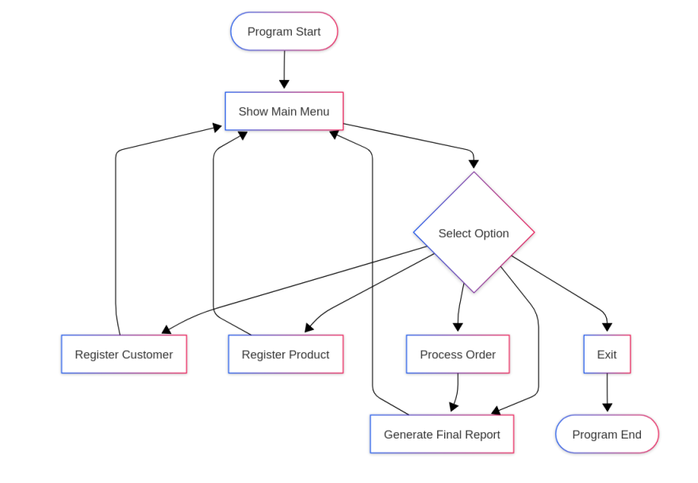

# Customer Order Management System 📦🛒

This project is a **Python-based** management system developed to handle customer data, product inventory, and sales orders. It allows for a complete workflow from registration to the generation of financial reports.

The objective of the project is to apply advanced modular programming concepts, focusing on **independent modules, data validation, and efficient data structures**.

---

## 📖 Program Description

The system provides a comprehensive interface to manage the sales cycle of a business. It is divided into specialized modules that handle:

*   **Customer Management**: Securely registering customer details.
*   **Product Inventory**: Storing product data using immutable structures.
*   **Order Processing**: Creating and linking orders between customers and products.
*   **Financial Reporting**: Calculating daily income and summarizing total sales.

The program ensures that each component (Customer, Product, Order) interacts correctly to maintain data integrity.

<p align="center">
  
</p>

## 🏗️ System Architecture

The project is organized into independent modules, each responsible for a specific functionality:

*   **`main.py`**: Main menu and program execution flow.
*   **`customers.py`**: Logic for customer registration.
*   **`products.py`**: Logic for product registration and inventory.
*   **`orders.py`**: Order creation and historical order query.
*   **`reports.py`**: Daily income calculation and final report generation.

---

## ⚙️ Features

The system currently allows:

*   **Register customers**: Add new clients to the database.
*   **Register products**: Populate the inventory with available items.
*   **Create orders**: Process sales transactions.
*   **View registered orders**: Consult the history of all processed sales.
*   **Calculate daily income**: Get real-time financial updates.
*   **Generate final report**: Export a summary of all business activities.

---

## 🧠 Data Structures Used

To ensure data consistency, the system utilizes the following structures:

**Dictionaries (`{}`):** Used to store customer records and order details for quick access.
**Tuples (`()`):** Used to represent product information to ensure data remains unchanged.

```python
# Example product tuple structure
product = (product_id, product_name, unit_price)

# Example customer storage
customers = {
    "customer_id": "customer_name"
}


